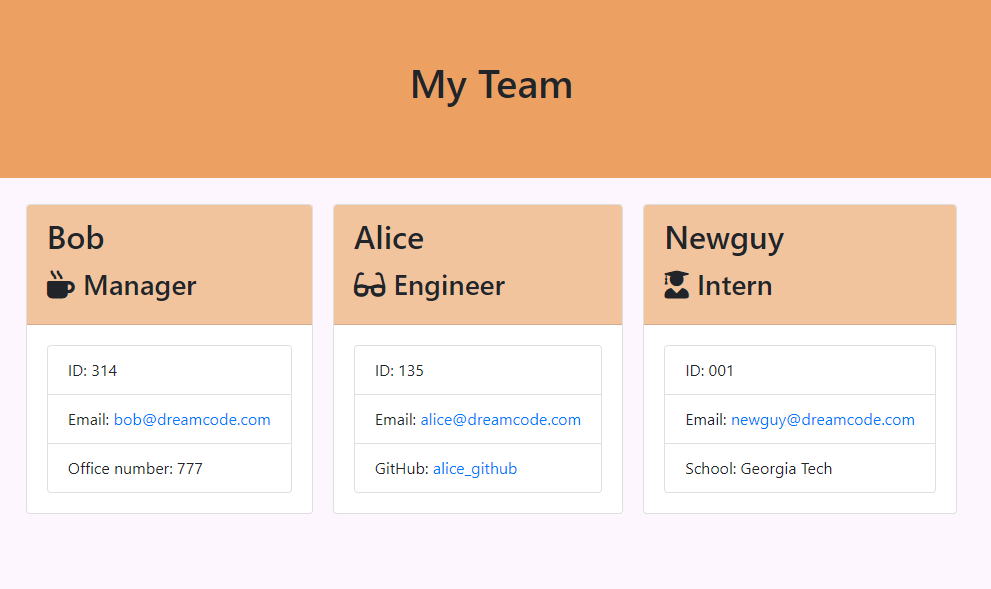

# ms-interconnect
CLI engineering team profile page generator

## Table of Contents
- [ms-interconnect](#ms-interconnect)
- [Description](#description)
- [Installation](#installation)
- [Usage](#usage)
- [Licence](#licence)
- [Contributing](#contributing)
- [Test](#test)
- [Questions](#questions)

## Description

This CLI app generates a engineering team profile page.




[GitHub Repo](https://www.github.com/brhestir/ms-interconnect)


## Installation
```bash
npm install
```

## Usage
```bash
node app.js
```

## Licence
MIT

## Contributing
Contributions welcome!

## Test
After running `npm install`, run:
```
npm test
```

## Questions
Questions are welcome, contact me on GitHub or in the comments.